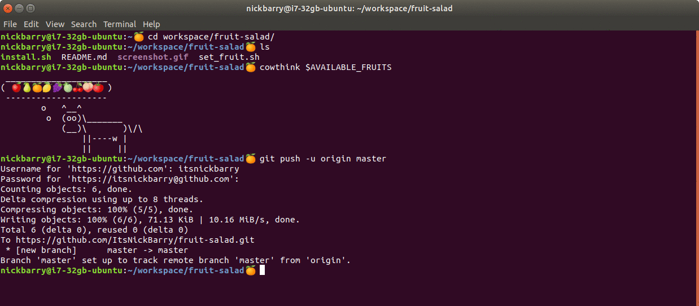

# Fruit $alad

Distinguish your terminal prompts from each other with pseudorandom fruits, selected for freshness.

This should be compatible with other modifications to the prompt; only the end is changed.

The `AVAILABLE_FRUITS` and `CURRENT_FRUIT` variables are assigned; if you rely on either of these, you might have some issues.

Note: not to be confused with `CURRANT_FRUIT`.

## Vegetables?
Replace the string assigned to `AVAILABLE_FRUITS` in your `.bashrc` with vegetables of your choice.

## Install
Run `install.sh` or add the contents of `set_fruit.sh` to your `.bashrc` file manually.

## Uninstall
Remove the lines from your `.bashrc` file which match the contents of `set_fruit.sh`.

